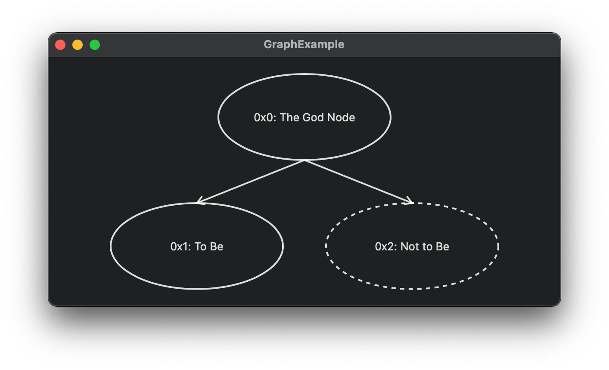

# InteractGraph


InteractGraph: A weak Graph tool.

<p align="center">
  
</p>

⚠️ **The `InteractGraph` is currently undergoing rapid iteration and the public APIs are not guaranteed to be stable.**

***

## Feature

- [x] filter

### Node Attributes

- [x] label
- [x] long label
- [x] border color
- [x] dashed border
- [x] shape: ellipse, rectangle, roundedRectangle

### Edge Attribute

- [x] directed
- [x] color
- [x] dashed

## Usage

Prepared graph.

```swift
import InteractGraph

var graph: Graph {

  let node0 = Node(id: 0x0, label: "0x0: TheBeginningOfEverything")
  ...
  let node42 = Node(id: 0x42, label: "0x42: TheAnswerToEverything")
  
  let edge0 = Edge(from: node0, to: node42)
  ...
  let edge42 = Edge(from: node42, to: node0)
 
  return Graph(nodes: [node0, ..., node42], edges: [edge0, ..., edge42])
}
```

Then bring `InteractGraphView` to your view

```swift
import SwiftUI
import InteractGraph

struct ContentView: View {

  var graph: Graph { ... }
  var body: some View {
    InteractGraphView(graph: graph)
  }
  
}
```

## Requirements

- iOS 15.0+
- macOS 12.0+

## Future of InteractGraph

- [ ] Optimize graph layering algorithm. (It's longest-path now)
- [ ] More Node's and Edge's Attribute support.
- [ ] JSON Graph data import.
- [ ] Graph data dynamic record.
- [ ] Accessibility.
- [ ] Tests

## Sponsors

GitHub sponsors is not supported my region yep.
